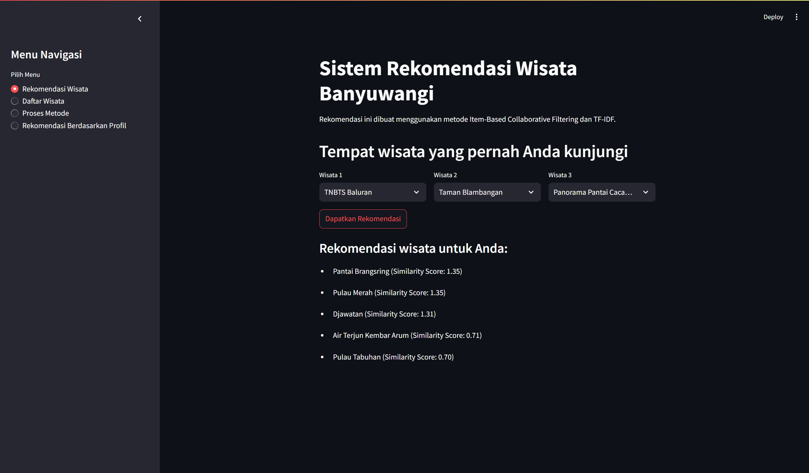

# 🌍 Sistem Rekomendasi Tempat Wisata Banyuwangi 🏞️

Selamat datang di **Sistem Rekomendasi Tempat Wisata di Banyuwangi**!  
Proyek ini adalah aplikasi berbasis **Streamlit** yang memberikan rekomendasi tempat wisata kepada pengguna berdasarkan **rating pengguna lain** dan **deskripsi fasilitas wisata**.

---

# 🔧 Metode yang Digunakan

1. Item-Based Collaborative Filtering (IBCF)
   Menghitung Cosine Similarity antar wisata berdasarkan rating pengguna.
   Wisata yang memiliki pola rating serupa direkomendasikan.
2. TF-IDF (Term Frequency-Inverse Document Frequency)
   Menganalisis deskripsi fasilitas wisata untuk mengetahui kata-kata penting.
   Menghitung Cosine Similarity antar wisata berdasarkan deskripsi fasilitas.
3. Kombinasi Metode
   Menggabungkan hasil IBCF dan TF-IDF dengan bobot tertentu untuk menghasilkan rekomendasi yang lebih akurat.

---

# ⚙️ Cara Menjalankan Proyek

1. Pastikan telah menginstal Python dan pustaka yang diperlukan.
   Jalankan perintah berikut di terminal: **pip install -r requirements.txt**
2. Jalankan aplikasi dengan perintah:
   **streamlit run app.py / python -m streamlit run app.py**
3. Setelah menjalankan perintah di atas, buka browser

# 🖼️ Contoh Running Program

---

# 📋 Nama Anggota Kelompok

Nama | NIM

1. Bintang Wahyu Ariyono - 220441100014
2. Agung Widodo - 220441100037
3. Fida Taufiq Imazuddin - 220441100057
4. Dwi Valentina Febriani - 220441100112
